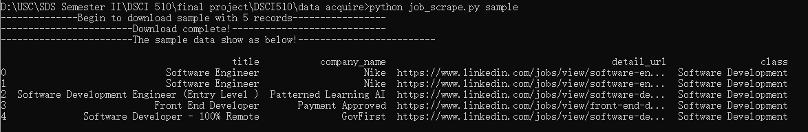
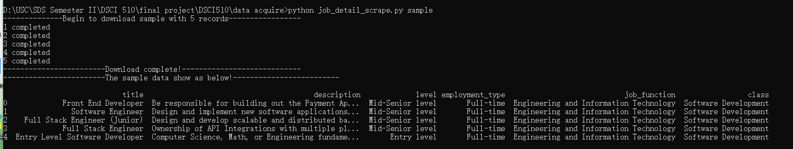
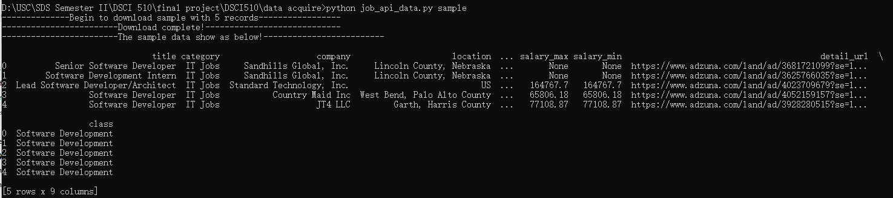
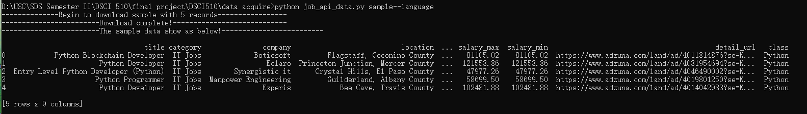

# DSCI510

## Introduction
This work is for the Final Project of USC DSCI 510. The goal of this project is to collect data of certain subject by using **API** and **web scrape**. Then do the any analyses on the data.

The aim of my project is to select data about **jobs** and do analyses about them. I specify the collecting data in five types of **tech job** including:
**``Software Development``**, **``Data Science``**, **``Data Analysis``**,**``Software Test``**, and **``Business Analysis``**. Moreover, I also scraped jobs by different keyword of ten programming languages, including **``Python``**, **``Java``**, **``C++``**, **``C#``**, **``TypeScript``**, **``PHP``**, **``Swift``**, **``JavaScript``**, **``Golang``**, **``Kotlin``**


There **some change** from my HW3. I give up collecting data from [Bureau of Labor Statistics](https://www.bls.gov/ces/data/employment-and-earnings). Cause i found the 2011-2018 data was in pdf format, not web table which is hard to collect. The other content was no change.

## Datasets
There are **four datasets** in this project and they are sorted in the sqlite database which name is jobdb. Every dataset have a **sample_dataset** which is convenient for other people (like grader) to check or run the code in sample mode.

### Pglanguage Dataset
This dataset is collected by [Adzuna API](https://developer.adzuna.com/). This dataset has **10,000** tuples and **9** attributes. Collecting data by ten programming language mentioned above, every programming keyword has 1,000 records.

The following table is the information of every attribute

<div align="center">

|Attribute|Description|Type|
|:---:|:---:|:---:|
|**title**|Name of Job|TEXT|
|**category**|category of Job|TEXT|
|**company**|Name of Company|TEXT|
|**location**|Work Location|TEXT|
|**salary_predict**|Whether having salary information. 1:yes 0:no|TEXT|
|**salary_max**|Maximum salary of this Job|TEXT|
|**salary_max**|minimum salary of this Job|TEXT|
|**detail_url**|Job detail webpage URL|TEXT|
|**class**|belong to which tech job|Text|

</div>

Part Content of the dataset:


### Jobs Dataset
This dataset is collected by [Adzuna API](https://developer.adzuna.com/). This dataset has **10,000** tuples and **9** attributes as the Pglanguage Dataset. Collecting data by five tech job category mentioned above, every tech job has 2,000 records.

Part Content of the dataset:


### JobLinkedin Dataset & JobDetail Dataset
These two datasets are collect from [LinkedIn](https://www.linkedin.com/jobs/search/?keywords=python&location=United%20States&trk=guest_job_search_jobs-search-bar_search-submit&redirect=false&position=1&pageNum=0&original_referer=).

- JobLinkedin
This dataset has **5,000** records, **4** attributes. This dataset is collecting by searching the job based on five tech jobs mentioned above.

<div align="center">

|Attribute|Description|Type|
|:---:|:---:|:---:|
|**title**|Name of Job|TEXT|
|**company**|Name of Company|TEXT|
|**detail_url**|Job detail webpage URL|TEXT|
|**class**|belong to which tech job|TEXT|

</div>

Part Content of the dataset:


- JobDetail
This dataset has **250** records, **6** attributes. This dataset is collecting by scraping the url provided in JobLinkedin dataset. Every tech class has 50 records which is the first 50 records.

<div align="center">

|Attribute|Description|Type|
|:---:|:---:|:---:|
|**title**|Name of Job|TEXT|
|**description**|Detail description of job, may including requirement, job duties, etc.|TEXT|
|**levels**|Job requirement level|TEXT|
|**employment_type**|Full-time, Part-time,Internship, etc|TEXT|
|**job_function**|Job function category|TEXT|
|**class**|belong to which tech job|TEXT|

</div>

Part Content of the dataset:


## How to Run

All the data acquiring .py files in the ```data acquire``` directory.

- **job_scrape.py**
  This python file corresponds to JobLinkedin dataset. You can run the whole scraping in terminal with command ```python job_scrape.py``` or run it in the sample mode with ```python job_scrape.py sample```. After running you will get a table in the jobdb.sqlite. In sample mode, you will also get a DataFrame printed in terminal like:




- **job_detail_scrape.py**
  This python file corresponds to JobDetail dataset. Similarly to job_scrape.py, run ```python job_detail_scrape.py``` to get the whole dataset or run ```python job_detail_scrape.py sample``` to get the sample data:



  Note: This program is a little slow and easy to break. May need rerun sometimes.
  
- **job_api_data.py**
This python file corresponds to the Jobs dataset and Pglanguage dataset.

  - running command ```python job_api_data.py``` to get the whole Jobs dataset or running ```python job_api_data.py sample``` to the sample Jobs dataset and output:
   

  - running command ```python job_api_data.py pglanguage``` to get the whole Pglanguage dataset or running ```python job_api_data.py sample--language``` to get the Pglanguage sample dataset and output:
   
 

## The Plan of Analysis
I try to combine the jobDetail dataset and JobLinkedin dataset in the future. And the future analysis plan is to analysis which tech job has more salary and which programming language is more popular currently. Moreover, try to analysis the description of jobs to find out what's the requirements of different tech jobs. I plan to create word cloud to analysis this problem. And there may be other statistical analyses.