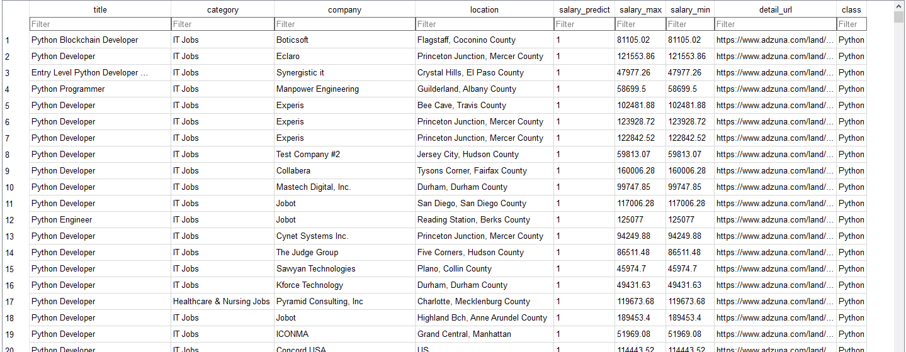
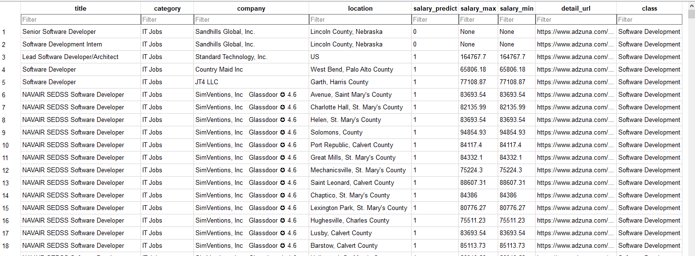
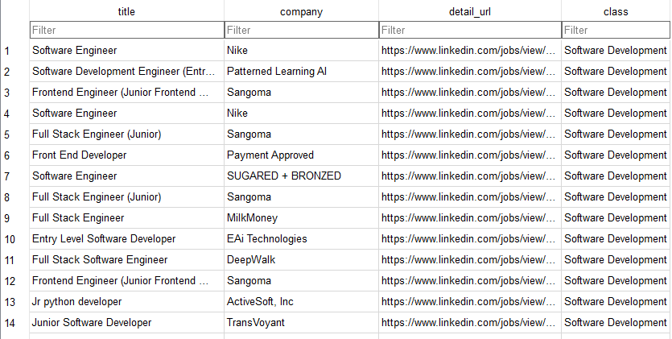
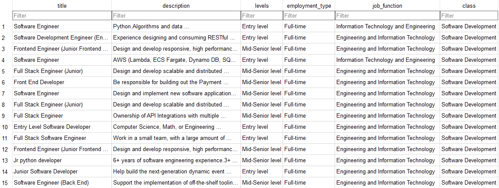

# DSCI510

## Introduction
This work is for the Final Project of USC DSCI 510. The goal of this project is to collect data of certain subject by using **API** and **web scrape**. Then do the any analyses on the data.

The aim of my project is to select data about **jobs** and do analyses about them. I specify the collecting data in five types of **tech job** including:
**``Software Development``**, **``Data Science``**, **``Data Analysis``**,**``Software Test``**, and **``Business Analysis``**. Moreover, I also scraped jobs by different keyword of ten programming languages, including **``Python``**, **``Java``**, **``C++``**, **``C#``**, **``TypeScript``**, **``PHP``**, **``Swift``**, **``JavaScript``**, **``Golang``**, **``Kotlin``**

There **some change** from my HW3. I give up collecting data from [Bureau of Labor Statistics](https://www.bls.gov/ces/data/employment-and-earnings). Cause i found the 2011-2018 data was in pdf format, not web table which is hard to collect. The other content was no change.

## Datasets
There are **four datasets** in this project and they are sorted in the sqlite database. Every dataset have a **sample_dataset** which is convenient for other people (like grader) to check or run the code in sample mode.

### Pglanguage Dataset
This dataset is collected by [Adzuna API](https://developer.adzuna.com/). This dataset has **10,000** tuples and **9** attributes. Collecting data by ten programming language mentioned above, every programming keyword has 1,000 records.

The following table is the information of every attribute

|Attribute|Description|Type|
|:---:|:---:|:---:|
|**title**|Name of Job|TEXT|
|**category**|category of Job|TEXT|
|**company**|Name of Company|TEXT|
|**location**|Work Location|TEXT|
|**salary_predict**|Whether having salary information. 1:yes 0:no|TEXT|
|**salary_max**|Maximum salary of this Job|TEXT|
|**salary_max**|minimum salary of this Job|TEXT|
|**detail_url**|Job detail webpage URL|TEXT|
|**class**|belong to which tech job|Text|

Part Content of the dataset:

### Jobs Dataset
This dataset is collected by [Adzuna API](https://developer.adzuna.com/). This dataset has **10,000** tuples and **9** attributes as the Pglanguage Dataset. Collecting data by five tech job category mentioned above, every tech job has 2,000 records.

Part Content of the dataset:

### JobLinkedin Dataset & JobDetail Dataset
These two datasets are collect from [LinkedIn](https://www.linkedin.com/jobs/search/?keywords=python&location=United%20States&trk=guest_job_search_jobs-search-bar_search-submit&redirect=false&position=1&pageNum=0&original_referer=).

- JobLinkedin
This dataset has **5,000** records, **4** attributes. This dataset is collecting by searching the job based on five tech jobs mentioned above.

|Attribute|Description|Type|
|:---:|:---:|:---:|
|**title**|Name of Job|TEXT|
|**company**|Name of Company|TEXT|
|**detail_url**|Job detail webpage URL|TEXT|
|**class**|belong to which tech job|TEXT|

Part Content of the dataset:

- JobDetail
This dataset has **250** records, **6** attributes. This dataset is collecting by scraping the url provided in JobLinkedin dataset. Every tech class has 50 records which is the first 50 records.

|Attribute|Description|Type|
|:---:|:---:|:---:|
|**title**|Name of Job|TEXT|
|**description**|Detail description of job, may including requirement, job duties, etc.|TEXT|
|**levels**|Job requirement level|TEXT|
|**employment_type**|Full-time, Part-time,Internship, etc|TEXT|
|**job_function**|Job function category|TEXT|
|**class**|belong to which tech job|TEXT|

Part Content of the dataset:

## How to Run

## The Plan of Analysis